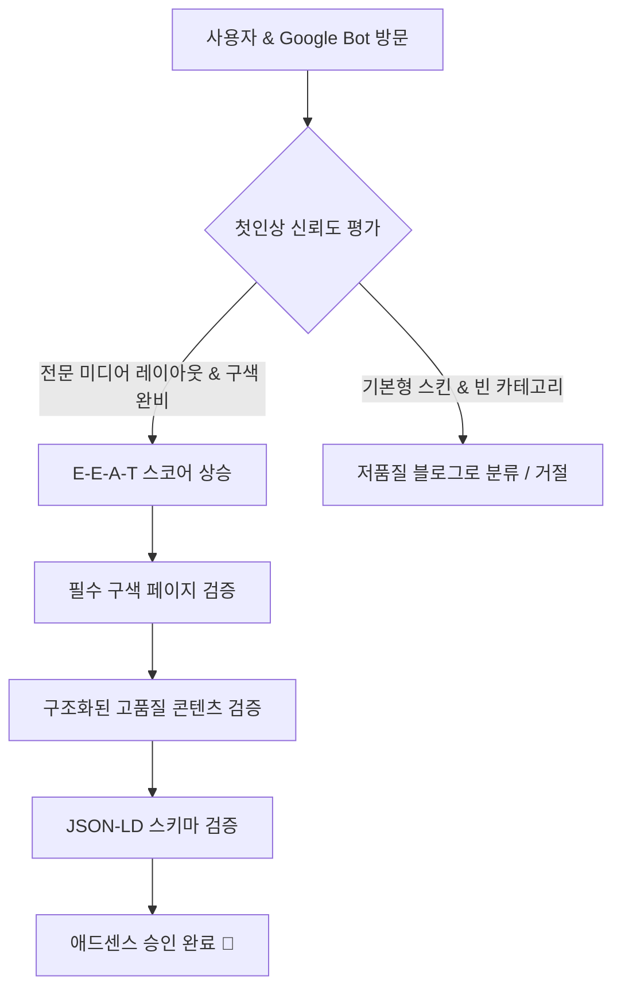

# 🚀 2026년 최신 구글 애드센스 승인 보증 전략 기획서: 브랜드&언론사형 전환 (E-E-A-T 극대화)

> [!NOTE]
> 최근 구글 애드센스 심사는 단순히 **"AI로 찍어낸 글 수십 개"**가 아닌, 사이트가 갖춘 **"구색(Structure)"**과 **"신뢰도(Trustworthiness)"**를 최우선으로 평가합니다. 
> 본 기획서는 공유해주신 공지글의 흐름과 성공 사례 사이트인 **이지이콘(ezecon.co.kr)**의 벤치마킹 분석을 바탕으로, 애드센스 승인을 확실히 받아내기 위한 최적의 방안을 단계별로 기획한 종합 제안서입니다.

---

## 📊 애드센스 심사 트렌드 변화 분석

과거의 애드센스 승인 방식과 현재 승인 성공 사례들의 핵심 차이는 다음과 같습니다.

| 평가 항목 | 과거 (2023~2024년 이전) | 현재 (2025~2026년 최신 트렌드) |
| :--- | :--- | :--- |
| **핵심 기준** | 포스팅 개수 (글 20~30개) | **사이트의 구색과 전문적인 레이아웃** |
| **콘텐츠 소스** | AI 단순 생성글로도 쉽게 통과 | 독창적인 관점, 실용적 편집(표, 목록) 및 **E-E-A-T** |
| **사이트 형태** | 전형적인 개인 블로그 형태 | **실제 언론사, 브랜드, 기업 연구소 홈페이지 형태** |
| **필수 신뢰 요소** | 개인정보처리방침 정도만 대충 추가 | 상세 개인정보처리방침, 이용약관, 운영자 정보, 실제 연락처 |
| **구조 설계** | 카테고리 구성 무관 | 완벽한 카테고리 구조화 및 **Structured Data (스키마)** |

---

## 🛠️ 핵심 전략: "언론사 및 브랜드사 의태(擬態)" 전략

구글 리뷰어(인간 검수자 및 AI 봇)가 사이트에 접속했을 때, **"광고 수익만을 위해 대충 만든 블로그가 아니라, 실제로 유익한 정보를 지속적으로 발행하는 전문 미디어/브랜드 채널이구나"**라는 첫인상을 주는 것이 핵심입니다.



---

## 1. 🏢 신뢰 요소(Trust Signals) 구축 계획

성공 사례인 이지이콘(`ezecon.co.kr`)의 가장 큰 특징은 **실제 오프라인 비즈니스를 운영하는 것처럼 투명한 신뢰 요소**를 대외적으로 노출하고 있다는 점입니다.

### ① 사업자 및 운영자 정보 명시 (Footer)
블로그 하단(Footer)에 개인 정보가 아닌, **사이트 운영 주체**의 정보를 상세히 기입합니다.
* **사이트명:** (예: 글로벌 이코노믹 인사이트)
* **운영자/편집장:** (예: 홍길동 / 수석 연구원)
* **이메일 주소:** `admin@yourdomain.com` (G-Mail 대신 자체 도메인 메일 사용 권장)
* **연락처:** (예: 0507-XXXX-XXXX) 또는 이메일 연락처
* **가상 주소/약도:** 실제 위치를 구글 맵과 연동하여 스키마에 포함하면 신뢰도가 수십 배 올라갑니다.

### ② 고도화된 스키마 마크업 (Structured Data) 적용
구글 봇에게 사이트의 정체성을 완벽하게 전달하기 위해 `NewsMediaOrganization` 또는 `Organization` 타입의 스키마를 JSON-LD 형식으로 헤더에 삽입합니다.

```json
{
  "@context": "https://schema.org",
  "@graph": [
    {
      "@type": "NewsMediaOrganization",
      "@id": "https://yourdomain.com/#organization",
      "name": "미디어 이름",
      "url": "https://yourdomain.com",
      "email": "admin@yourdomain.com",
      "address": {
        "@type": "PostalAddress",
        "streetAddress": "도로명 주소 123",
        "addressLocality": "구/군",
        "addressRegion": "도시",
        "postalCode": "12345",
        "addressCountry": "KR"
      },
      "description": "본 미디어는 인공지능 경제 분석 및 시황 정보를 전문적으로 제공하는 디지털 뉴스 플랫폼입니다."
    }
  ]
}
```

---

## 2. 📄 4대 필수 신뢰 페이지 완벽 설계

구글 애드센스 심사 봇이 반드시 크롤링하는 4대 필수 페이지를 디테일하게 생성합니다.

### ① 개인정보처리방침 (Privacy Policy)
* **핵심 포인트:** 구글 애드센스 쿠키(DART 쿠키) 수집에 대한 내용이 반드시 포함되어야 합니다.
* **포함될 내용:** "당사는 제3자 광고 회사(Google)를 사용하여 사용자가 웹사이트를 방문할 때 광고를 제공하며, 구글은 쿠키를 사용하여 사용자의 방문 기록에 기반한 맞춤형 광고를 노출합니다..."라는 명시적 문구.

### ② 이용약관 (Terms of Service)
* **핵심 포인트:** 사이트 내 콘텐츠 무단 복제 방지, 이용자의 권리 및 의무, 서비스 이용 기준 등을 명문화하여 공식적인 미디어의 면모를 보여줍니다.

### ③ 문의하기 페이지 (Contact Us)
* **핵심 포인트:** 단순히 이메일 한 줄 적어놓는 것이 아니라, 사용자가 직접 메세지를 보낼 수 있는 **인터랙티브한 문의 폼(Contact Form)**을 배치합니다. 구글 봇은 이러한 기능적 완성도를 높게 평가합니다.

### ④ 에디터/운영진 소개 (About Us / Editorial Team)
* **핵심 포인트:** 필진의 프로필 사진(또는 전문적인 일러스트), 약력, 전문 분야를 기재하여 **"누가 이 전문적인 글을 쓰는지"** 명확히 밝힙니다. 이는 구글 E-E-A-T 가이드라인의 '전문성(Expertise)'에 직결됩니다.

---

## 3. 📂 카테고리 구조 및 디자인 최적화

카테고리는 무조건 단순하고 명확하게 설계해야 합니다.

### ① 카테고리 슬림화 (2~3개 추천)
* **주의사항:** 카테고리만 많고 정작 누르면 글이 1~2개밖에 없는 상태는 **"콘텐츠 부족(Valueless Content)"**의 결정적 원인이 됩니다.
* **전략:** 승인 전까지는 딱 **2개**의 카테고리만 운영하고, 각 카테고리에 최소 **10개 이상의 풍부한 글**을 채워 넣습니다.
* **추천 카테고리 구성 (예시 - 금융/경제 테마):**
  * `[카테고리 1] 거시 경제 트렌드` (시황, 금리, 인플레이션 분석)
  * `[카테고리 2] 생활 금융 가이드` (세금, 예적금, 재테크 기초 정책 정보)

### ② 브레드크럼(Breadcrumbs) 및 탐색 경로 강화
* 사이트 상단에 `홈 > 거시 경제 트렌드 > 2026년 금리 전망` 과 같은 브레드크럼 구조를 노출하여 크롤러가 사이트 구조를 쉽게 이해할 수 있도록 돕습니다.
* 태그(Tag) 페이지도 깔끔한 스타일로 적용하여 내부 링크 구조를 강화합니다.

---

## 4. ✍️ AI + Human 하이브리드 콘텐츠 구축 전략

구글은 AI가 쓴 글을 무조건 거절하지 않습니다. 단, **"누가 봐도 AI가 단 3초 만에 뽑아낸 무성의한 텍스트"**는 철저히 걸러냅니다. 

### 💡 승인 확률을 극대화하는 포스팅 템플릿 구조

구글이 좋아하는 글은 **가독성이 높고, 구조화되어 있으며, 실용적인 정보**가 풍부한 글입니다.

```
[포스팅 제목] - SEO 최적화된 매력적인 제목 (예: "2026년 종합소득세율 변경안 요약 및 세액 공제 극대화 꿀팁")

1. 도입부 (Introduction)
   - 이 글이 독자에게 왜 중요한지 환기 (3~4줄)
   - 핵심 요약을 나타내는 [💡 요약 팁 박스 / 인용구] 배치

2. 본문 1 - 핵심 정책/정보 분석 (h2 태그)
   - 상세한 팩트 전달
   - 복잡한 수치나 일정은 반드시 [📊 비교 표(Table)] 또는 [📌 체크리스트(List)]로 정리

3. 본문 2 - 실질적인 혜택 및 신청 방법 (h2 태그)
   - 독자가 즉시 행동할 수 있는 단계별 가이드 제공 (1단계, 2단계...)
   - 관련 기관 공식 홈페이지(정부 사이트 등)로 연결되는 [🔗 아웃바운드 신뢰 링크] 추가

4. 결론 및 에디터 의견 (Conclusion) (h3 태그)
   - 정보 정리 및 에디터의 독창적인 종합 의견 추가 (E-E-A-T 완성)
```

### 🚨 AI 글 작성 시 절대 피해야 할 체크리스트
* [ ] "~에 대해 알아보겠습니다.", "~인 것 같습니다." 등의 획일화된 AI 특유의 어투 최소화 (자연스러운 한국어 어투로 수정)
* [ ] 하나의 포스팅에 최소 **1,500자 이상**의 분량 확보
* [ ] 글자만 빽빽한 화면 피하기 (중간중간 볼드체 적용, 구분선 삽입, 배경색이 들어간 정보 상자 활용)

---

## 📅 애드센스 승인 패스트트랙 로드맵 (4주 완성 계획)

```
[1주차: 셋업] ────────> [2주차: 빌드업] ────────> [3주차: 콘텐츠 채우기] ────────> [4주차: 신청 및 관리]
- 도메인 연결             - 필수 4대 페이지 제작    - 타겟 카테고리 글 쓰기    - 구글 서치콘솔 색인 확인
- 디자인 시스템 구축      - 스키마 마크업 삽입      - 1일 1포스팅 (총 20개)   - 애드센스 최종 심사 청구
```

### 1주차: 도메인 & 인프라 셋업 및 디자인 구현
1. **개인 도메인(.com, .co.kr 등) 구매 및 연결** (티스토리 하위 도메인 등은 승인이 매우 어렵습니다).
2. **워드프레스 또는 경량/고속 정적 프레임워크 기반 사이트 구축**
3. **미디어사/언론사 스타일의 테마 설정** (지저분한 배너나 불필요한 위젯을 제거하고 본문에 온전히 집중하는 미니멀리즘 디자인).

### 2주차: 사이트 "구색" 완비
1. **4대 필수 페이지 생성** (이용약관, 개인정보처리방침, 문의하기 폼, 소개 페이지).
2. **Footer 영역의 기업/미디어 정보 명시 및 JSON-LD 스키마 마크업 삽입**.
3. **구글 서치콘솔(Search Console) 및 네이버 서치어드바이저에 사이트 등록**.

### 3주차: E-E-A-T 기반의 핵심 고품질 콘텐츠 발행
1. 설정한 2개 카테고리에 맞춰 하루 1~2개씩 고품질 하이브리드 포스팅 업로드.
2. 각 글마다 독창적인 서식(표, 요약 상자, 체크리스트)을 적용하여 **체류 시간(Dwell Time)** 극대화 유도.
3. 총 포스팅 개수 **15개 이상** 확보.

### 4주차: 최종 검증 및 승인 신청
1. 발행된 모든 포스팅이 구글 서치콘솔에 정상적으로 **색인(Indexing)** 되었는지 검증.
2. 깨진 링크나 로딩 속도 저하 요인이 없는지 모바일/데스크톱 속도 측정(Lighthouse)으로 점검.
3. 구글 애드센스 승인 신청 완료 후 심사 기간 동안 지속적으로 주 2~3회 예비 포스팅 업로드 유지.

---

## 💬 Antigravity 파트너로서의 제안

> [!TIP]
> 위 기획서의 핵심은 **"단순 블로그가 아닌 professional한 미디어를 만드는 것"**입니다. 
> 
> 저와 함께 진행하신다면 다음과 같은 실질적인 작업을 즉시 도와드릴 수 있습니다:
> 1. **신뢰성 극대화 스키마 코드 제작**: 사용자님의 도메인과 주소 정보에 맞춤화된 완벽한 JSON-LD 코드 생성.
> 2. **이용약관 및 개인정보처리방침 작성**: 구글 광고 정책 규정을 완벽하게 만족하는 프로페셔널한 한국어 전문 텍스트 작성.
> 3. **검색 엔진 최적화(SEO) 글쓰기 템플릿 및 실제 AI 생성 보완 프롬프트** 설계.
> 4. **문의하기(Contact Form) 웹 컴포넌트 마크업 및 스타일링** 개발.

사용자님께서 원하시는 사이트의 방향(예: 경제/금융, IT/테크, 리빙/건강 등)을 말씀해 주시면 그에 최적화된 **1대1 커스텀 로드맵 및 콘텐츠 기획안**으로 바로 보완해 드리겠습니다. 언제든 피드백을 들려주세요!
